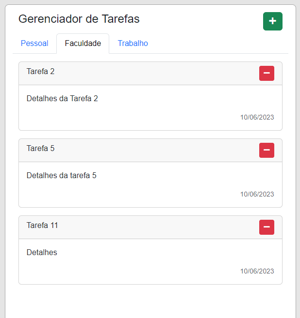

# Frontend - Gerenciamento de Tarefas 




> Este frontend foi desenvolvido como trabalho de conclusão do módulo basico da Pós-Graduação em Desenvolvimento FullStack da PUC-RIO. Ela foi desenvolvida utilizando as tecnologias JavaScript, CSS (Bootstrap) e HTML. 

## 💻 Pré-requisitos

Antes de começar, verifique se você atendeu aos seguintes requisitos:

* Você tem uma máquina `<Windows / Linux / Mac>`.
* Você tem um navegador de internet `<Edge / Chrome / Safari>`.

## ☕ Usando <Frontend - Gerenciamento de Tarefas>

```
Basta fazer download do projeto e abrir o arquivo index.html usando o navegador da sua preferência.
```
